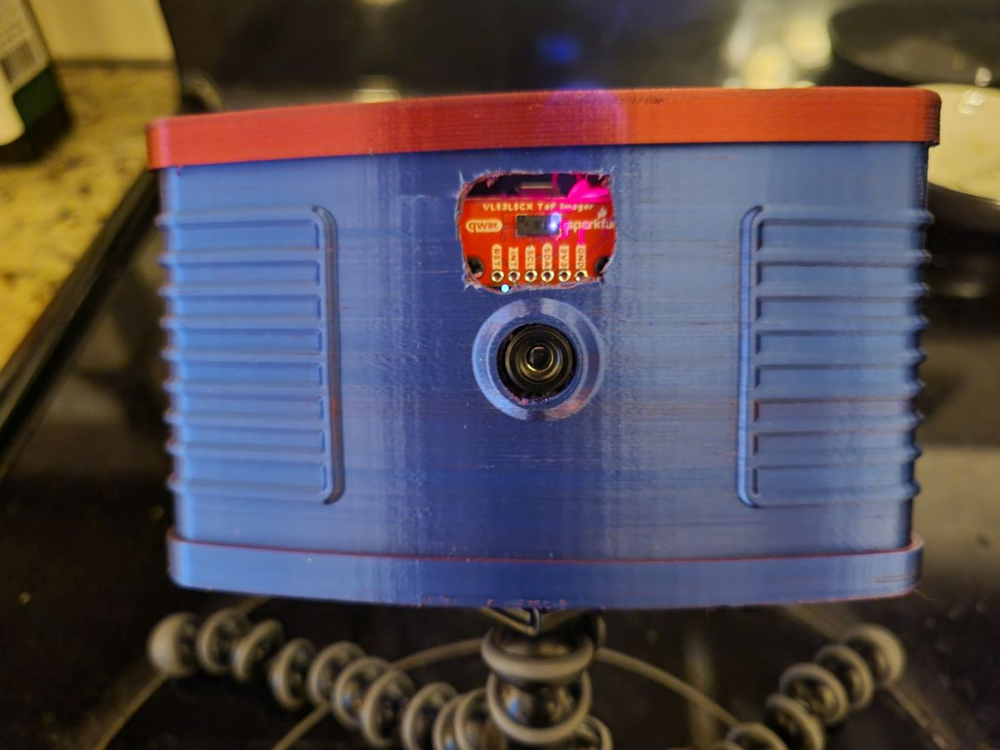

# Pybadge Thermal+Depth Camera  
  
This project builds on Adafruit's ["MLX90640 Thermal Camera."](https://learn.adafruit.com/mlx90640-thermal-image-recording/)  
  
This project adds a VL53L5CX 8x8 depth sensor to the original PyBadge + MLX90640 32x24 thermal camera. It also adds various features  
- 2x and 4x Bilinear interpolation
- Normal and smoothstep options for the bilinear interpolation
- View selection of thermal data, depth data, or a two-channel thermal + depth image
- Captured thermal and depth data are now stored as CSV files
- An exponentially weighted moving average (EWMA), to smooth viewed data over time
- A frame rate readout
- Two options for displaying depth data. The VL53L5CX returns up to 4 range measurements per zone (of the 8x8 zones)
     - One mode shows the nearest return, the other attemps to 'intelligently' combine all of the information for a 3x upscaled image
     - In either mode, all available measurements are saved to CSV when an image is captured
     - I have only been able to get, at most, three returns per zone. Getting more than 1 requires modifying platform.h in the Sparkfun VL53LCX library files  
  
Unfortunately, my changes have slowed things down considerably, it now maxes out around 3 frames per second.  
  
A note about connecting the VL53LCX: I had issues with the VL53LCX because the PyBadge puts VBat on the Qwiic connector instead of 3.3V. The Pybadge does have 3.3V available on a header; this requires some modification of the Qwiic connector, or not using the connector.  
In addition to Adafruit's hardware and code for the PyBadge thermal camera, this uses a breakout board and code from SparkFun for the [VL53L5CX](https://learn.sparkfun.com/tutorials/qwiic-tof-imager---vl53l5cx-hookup-guide)  
  
## VL53L5CX Mount  
This folder contains an STL and source OpenSCAD file for a 3D printable part that can be used to mount the VL53L5CX in the Pybadge Camera. The mount can be glued in place above the thermal camera, and requires two screws for the depth sensor.  
The front of the camera can be opened up with a pair of snips, hot knife tool, or rotary tool. The opening needs to be fairly wide to prevent any blockage of the sensor's field of view.  
   
## Controls  
This section of the readme describes the camera's controls and interface.  

- Power Switch: It does exactly what you would expect.
- Reset Button: This resets the microcontroller. You might expect this button to take a picture, but that isn't the design Adafruit went with.
- Micro USB Port: For power, uploading code, and downloading captured data.
- A Button: Capture an image, either thermal, depth, or both depending on the current setting.
- B Button: Enter a settings menu with various options. Navigate with the B button, and select options with the A button.
- Up (D-Pad): Toggle the upsampling level, 1x, 2x, or 4x.
- Right (D-Pad): Toggle smoothstep on and off.
- Down (D-Pad): Cycle between modes - thermal imaging, depth imaging, "intelligent" depth imaging, thermal + depth, thermal + "intelligent" depth
- Left (D-Pad): Toggle the temporal smoothing (EWMA) weight.
- Select Button: Toggle display between showing frame rate, and frame count.
- Start Button: Unused.

The user interface shows the current level of upsamling, the current frame count or framerate (frames per second), the current EWMA weight, a battery indicator, a capture indicator (while capturing), and the lowest, center-of-view, and highest temperatures in the scene.  
  

      

    
  

      

    
  

  
      

    
  

  
      

    

---
  
## Post Processing  
This folder contains two Python scripts, Visualize.py and Calibration.py, as well as some captured data and screenshots.  
**Visualize.py** projects captured thermal data into 3D space using captured depth data. This projection is not particularly accurate, but it is subjectively correct. See the screenshots below.  

    

  
  

    

  
  
**Calibration.py** was an attempt to calculate gain and offset for each pixel in the thermal and depth cameras. I do not think the improvement in the calibrated thermal images is noteworthy, and I haven't tried with depth data. I assume the errors in both sensors are noise dominated.  

    

